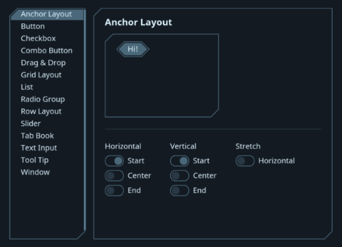

Ebiten UI
=========

This is a fork of the origin Ebiten UI, which can be found [here](https://github.com/blizzy78/ebitenui).

**A user interface engine and widget library for [Ebiten]**

Ebiten UI is an extension to Ebiten that provides an engine to render a complete user interface,
with widgets such as buttons, lists, combo boxes, and so on. It uses the [retained mode] model.
All graphics used by Ebiten UI can be fully customized, so you can really make your UI your own.

Documentation on how to use and extend Ebiten UI is available at [ebitenui.github.io](https://ebitenui.github.io).

*Ebiten UI is currently under development and should not yet be used in production.*

License
-------

Ebiten UI is licensed under the MIT license.

[Ebiten]: https://ebiten.org
